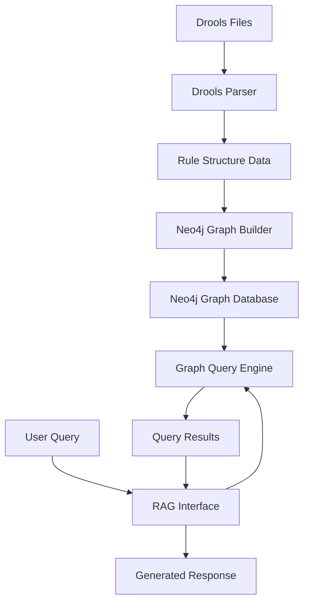

# Design Document: Drools Graph RAG System

## Overview

The Drools Graph RAG system is designed to parse Drools rule files (.drl), extract their structure and relationships, and create a knowledge graph in Neo4j. This graph will then be used to power a Retrieval-Augmented Generation (RAG) system that can answer natural language queries about the rules, their relationships, and their business logic.

The system consists of four main components:
1. **Drools Parser**: Parses .drl files to extract rules, conditions, actions, and dependencies
2. **Neo4j Graph Builder**: Creates and maintains the knowledge graph in Neo4j
3. **Graph Query Engine**: Provides methods to query the graph for specific information
4. **RAG Interface**: Handles natural language queries and generates responses using the graph data

## Architecture



### System Flow

1. The system scans the drools folder for .drl files
2. The Drools Parser extracts structured data from each file
3. The Neo4j Graph Builder creates nodes and relationships in the graph database
4. When a user submits a query, the RAG Interface processes it
5. The Graph Query Engine retrieves relevant information from Neo4j
6. The RAG Interface generates a response based on the retrieved information

## Components and Interfaces

### 1. Drools Parser

The Drools Parser is responsible for parsing .drl files and extracting structured information about rules, conditions, actions, and dependencies.

#### Key Classes:

```python
class DroolsParser:
    def parse_file(self, file_path: str) -> RuleFile:
        """Parse a .drl file and return a RuleFile object"""
        
    def parse_directory(self, directory_path: str) -> List[RuleFile]:
        """Parse all .drl files in a directory and return a list of RuleFile objects"""
        
class RuleFile:
    package: str
    imports: List[Import]
    globals: List[Global]
    rules: List[Rule]
    
class Import:
    package: str
    class_name: str
    
class Global:
    type: str
    name: str
    
class Rule:
    name: str
    extends: Optional[str]
    salience: Optional[int]
    conditions: List[Condition]
    actions: List[Action]
    
class Condition:
    variable: str
    type: str
    constraints: List[Constraint]
    
class Constraint:
    field: str
    operator: str
    value: str
    
class Action:
    type: str  # method_call, assignment, etc.
    target: str
    method: Optional[str]
    arguments: List[str]
```

### 2. Neo4j Graph Builder

The Neo4j Graph Builder creates and maintains the knowledge graph in Neo4j based on the parsed rule data.

#### Key Classes:

```python
class Neo4jGraphBuilder:
    def __init__(self, uri: str, username: str, password: str):
        """Initialize connection to Neo4j"""
        
    def create_graph(self, rule_files: List[RuleFile]) -> None:
        """Create a graph from a list of RuleFile objects"""
        
    def update_graph(self, rule_files: List[RuleFile]) -> None:
        """Update the graph with new or modified rule files"""
        
    def clear_graph(self) -> None:
        """Clear all nodes and relationships in the graph"""
```

#### Graph Schema:

```cypher
// Node Labels
:RuleFile {path, package}
:Rule {name, salience}
:Condition {variable, type}
:Constraint {field, operator, value}
:Action {type, method}
:Class {name, package}
:Global {name, type}

// Relationship Types
(:RuleFile)-[:CONTAINS]->(:Rule)
(:RuleFile)-[:IMPORTS]->(:Class)
(:RuleFile)-[:DECLARES]->(:Global)
(:Rule)-[:EXTENDS]->(:Rule)
(:Rule)-[:HAS_CONDITION]->(:Condition)
(:Rule)-[:HAS_ACTION]->(:Action)
(:Condition)-[:HAS_CONSTRAINT]->(:Constraint)
(:Condition)-[:REFERENCES]->(:Class)
(:Action)-[:REFERENCES]->(:Class)
(:Action)-[:MODIFIES]->(:Global)
```

### 3. Graph Query Engine

The Graph Query Engine provides methods to query the Neo4j graph for specific information about rules and their relationships.

#### Key Classes:

```python
class GraphQueryEngine:
    def __init__(self, uri: str, username: str, password: str):
        """Initialize connection to Neo4j"""
        
    def find_rules_by_name(self, name_pattern: str) -> List[Dict]:
        """Find rules by name pattern"""
        
    def find_rules_by_class_reference(self, class_name: str) -> List[Dict]:
        """Find rules that reference a specific class"""
        
    def find_rule_dependencies(self, rule_name: str) -> Dict:
        """Find dependencies of a specific rule"""
        
    def find_conflicting_rules(self) -> List[Dict]:
        """Find rules that might conflict with each other"""
        
    def find_rule_execution_path(self, initial_facts: List[str]) -> List[Dict]:
        """Find the potential execution path of rules given initial facts"""
        
    def find_unused_rules(self) -> List[Dict]:
        """Find rules that are never triggered or used"""
        
    def find_circular_dependencies(self) -> List[Dict]:
        """Find circular dependencies between rules"""
        
    def find_complex_rules(self, complexity_threshold: int) -> List[Dict]:
        """Find rules that exceed a complexity threshold"""
        
    def find_rule_patterns(self) -> Dict:
        """Identify common patterns and anti-patterns in rules"""
```

### 4. RAG Interface

The RAG Interface handles natural language queries and generates responses using the graph data.

#### Key Classes:

```python
class RAGInterface:
    def __init__(self, query_engine: GraphQueryEngine, embedding_model: str, llm_model: str):
        """Initialize the RAG interface with a query engine and models"""
        
    def process_query(self, query: str) -> str:
        """Process a natural language query and return a response"""
        
    def _extract_query_intent(self, query: str) -> Dict:
        """Extract the intent and entities from a query"""
        
    def _retrieve_relevant_information(self, intent: Dict) -> List[Dict]:
        """Retrieve relevant information from the graph based on intent"""
        
    def _generate_response(self, query: str, information: List[Dict]) -> str:
        """Generate a response based on the query and retrieved information"""
        
    def explain_rule_context(self, rule_name: str) -> str:
        """Provide contextual explanation of a rule including when it fires and what it affects"""
        
    def explain_rule_conflicts(self, rule_names: List[str]) -> str:
        """Explain conflicts between multiple rules and their resolution"""
        
    def explain_execution_order(self, rule_names: List[str]) -> str:
        """Explain the execution order of rules based on salience and dependencies"""
```

#### Visualization Interface

```python
class GraphVisualizationInterface:
    def __init__(self, query_engine: GraphQueryEngine):
        """Initialize the visualization interface with a query engine"""
        
    def generate_rule_graph(self, filters: Dict = None) -> Dict:
        """Generate a graph visualization of rules and their relationships"""
        
    def get_node_details(self, node_id: str) -> Dict:
        """Get detailed information about a specific node"""
        
    def filter_graph(self, filters: Dict) -> Dict:
        """Apply filters to the graph visualization"""
        
    def search_graph(self, query: str) -> List[Dict]:
        """Search for nodes in the graph"""
```

## Data Models

### Neo4j Graph Data Model

The Neo4j graph will store the following types of nodes and relationships:

1. **Nodes**:
   - **RuleFile**: Represents a .drl file
   - **Rule**: Represents a rule in a .drl file
   - **Condition**: Represents a condition in a rule
   - **Constraint**: Represents a constraint in a condition
   - **Action**: Represents an action in a rule
   - **Class**: Represents a Java class referenced in the rules
   - **Global**: Represents a global variable declared in the rules

2. **Relationships**:
   - **CONTAINS**: Links a RuleFile to its Rules
   - **IMPORTS**: Links a RuleFile to imported Classes
   - **DECLARES**: Links a RuleFile to declared Globals
   - **EXTENDS**: Links a Rule to its parent Rule
   - **HAS_CONDITION**: Links a Rule to its Conditions
   - **HAS_ACTION**: Links a Rule to its Actions
   - **HAS_CONSTRAINT**: Links a Condition to its Constraints
   - **REFERENCES**: Links a Condition or Action to referenced Classes
   - **MODIFIES**: Links an Action to modified Globals

### Example Graph Representation

For the rule "Validate Customer Age" in customer_validation.drl:

```
(RuleFile {path: "customer_validation.drl", package: "com.example.rules"})
    -[:CONTAINS]->(Rule {name: "Validate Customer Age", salience: 100})
        -[:HAS_CONDITION]->(Condition {variable: "$customer", type: "Customer"})
            -[:HAS_CONSTRAINT]->(Constraint {field: "age", operator: "<", value: "18"})
            -[:REFERENCES]->(Class {name: "Customer", package: "com.example.model"})
        -[:HAS_ACTION]->(Action {type: "method_call", method: "addError"})
            -[:MODIFIES]->(Global {name: "validationResult", type: "ValidationResult"})
```

## Error Handling

The system will implement comprehensive error handling to ensure robustness:

1. **Parsing Errors**:
   - Invalid syntax in .drl files
   - Missing or malformed rule components
   - Unresolvable references

2. **Database Errors**:
   - Connection failures to Neo4j
   - Transaction failures
   - Constraint violations

3. **Query Errors**:
   - Malformed queries
   - Timeout errors
   - Resource exhaustion

Each error will be logged with appropriate context and the system will attempt to continue processing other files or queries when possible.

## Testing Strategy

The testing strategy will cover all components of the system:

1. **Unit Tests**:
   - Test individual components in isolation
   - Mock dependencies for controlled testing
   - Cover edge cases and error conditions

2. **Integration Tests**:
   - Test interactions between components
   - Verify correct data flow between parser, graph builder, and query engine
   - Test with real Neo4j instance

3. **System Tests**:
   - End-to-end tests with sample Drools files
   - Verify correct graph construction
   - Test query processing and response generation

4. **Performance Tests**:
   - Test with large rule sets
   - Measure parsing time, graph construction time, and query response time
   - Identify bottlenecks and optimization opportunities

## Implementation Considerations

### Parsing Strategy

The Drools parser will use a combination of regular expressions and state machines to parse the .drl files. This approach is chosen over using the Drools API directly because:

1. It doesn't require a full Drools runtime environment
2. It can handle partial or malformed rules for better error recovery
3. It can extract additional metadata not directly accessible through the API

### Neo4j Setup and Configuration

#### Docker Compose Setup

The Neo4j database will be deployed using Docker Compose for ease of setup and consistency across environments. Here's the Docker Compose configuration:

```yaml
version: '3'
services:
  neo4j:
    image: neo4j:5.11.0
    container_name: drools_neo4j
    ports:
      - "7474:7474"  # HTTP
      - "7687:7687"  # Bolt
    environment:
      - NEO4J_AUTH=neo4j/password  # Change in production
      - NEO4J_dbms_memory_heap_max__size=2G
      - NEO4J_dbms_memory_pagecache_size=1G
      - NEO4J_PLUGINS=["apoc"]  # Include APOC plugin
    volumes:
      - neo4j_data:/data
      - neo4j_logs:/logs
      - neo4j_import:/var/lib/neo4j/import
      - neo4j_plugins:/plugins
    healthcheck:
      test: ["CMD", "curl", "-f", "http://localhost:7474"]
      interval: 10s
      timeout: 5s
      retries: 5

  neo4j-admin:
    image: neo4j:5.11.0
    depends_on:
      - neo4j
    volumes:
      - neo4j_data:/data
    command: >
      bash -c "sleep 10 && neo4j-admin dbms set-initial-password password"
    restart: on-failure

volumes:
  neo4j_data:
  neo4j_logs:
  neo4j_import:
  neo4j_plugins:
```

This setup includes:
- Neo4j database with APOC plugin for advanced graph operations
- Persistent volumes for data, logs, imports, and plugins
- Health check to ensure the database is running
- Initial password setup

#### Neo4j Browser Interface

The Neo4j Browser interface will be accessible at http://localhost:7474 after deployment, providing a graphical interface for:
- Visualizing the knowledge graph
- Running Cypher queries
- Managing database settings
- Monitoring performance

### MCP Server for Neo4j Integration

To integrate the Neo4j graph with LLMs via the Model Context Protocol (MCP), we'll implement a custom MCP server:

```python
class Neo4jMCPServer:
    def __init__(self, neo4j_uri, neo4j_user, neo4j_password, embedding_model):
        """Initialize the MCP server with Neo4j connection and embedding model"""
        self.query_engine = GraphQueryEngine(neo4j_uri, neo4j_user, neo4j_password)
        self.embedding_model = embedding_model
        self.vector_store = None
        
    def initialize(self):
        """Initialize the vector store with embeddings from the graph"""
        graph_data = self.query_engine.export_graph_data_for_embeddings()
        self.vector_store = self._create_vector_store(graph_data)
        
    def _create_vector_store(self, graph_data):
        """Create a vector store from graph data"""
        # Implementation using LangChain's vector store
        
    def handle_request(self, request):
        """Handle MCP request and return response"""
        query_type = request.get("query_type", "natural_language")
        query = request.get("query", "")
        
        if query_type == "natural_language":
            return self._handle_nl_query(query)
        elif query_type == "cypher":
            return self._handle_cypher_query(query)
        else:
            return {"error": "Unsupported query type"}
            
    def _handle_nl_query(self, query):
        """Handle natural language query using RAG"""
        # 1. Convert query to embedding
        # 2. Retrieve relevant graph nodes
        # 3. Generate Cypher query
        # 4. Execute query and format results
        
    def _handle_cypher_query(self, query):
        """Handle direct Cypher query"""
        # Execute Cypher query and return results
        
    def start_server(self, host="0.0.0.0", port=8000):
        """Start the MCP server"""
        # FastAPI implementation
```

#### MCP Configuration

The MCP server will be configured in the Kiro MCP settings:

```json
{
  "mcpServers": {
    "neo4j-drools-rag": {
      "command": "uvx",
      "args": ["drools-graph-rag.neo4j-mcp-server@latest"],
      "env": {
        "NEO4J_URI": "bolt://localhost:7687",
        "NEO4J_USER": "neo4j",
        "NEO4J_PASSWORD": "password",
        "EMBEDDING_MODEL": "sentence-transformers/all-mpnet-base-v2",
        "FASTMCP_LOG_LEVEL": "INFO"
      },
      "disabled": false,
      "autoApprove": ["query_graph", "explain_rule"]
    }
  }
}
```

#### LangChain Integration

The MCP server will integrate with LangChain for:

1. **Vector Storage and Retrieval**:
   - Store graph node embeddings in a vector database
   - Retrieve relevant nodes based on query similarity

2. **Query Generation**:
   - Convert natural language to Cypher queries
   - Use LLM to generate contextual queries

3. **Response Generation**:
   - Format graph query results into natural language
   - Provide contextual explanations of rules and relationships

### Neo4j Optimization

To optimize the Neo4j graph for performance:

1. Use appropriate indexes on frequently queried properties (rule names, class names)
2. Use relationship types to optimize traversal paths
3. Use Neo4j's APOC library for advanced graph operations
4. Implement batched updates for large rule sets
5. Configure memory settings based on data size and query complexity

### RAG Implementation

The RAG system will use:

1. Embeddings to convert natural language queries and graph data into vector representations
2. Vector similarity search to find relevant graph nodes
3. Graph traversal to explore relationships between nodes
4. A language model to generate natural language responses based on retrieved information

## Security Considerations

1. **Authentication**: Secure access to the Neo4j database using authentication
2. **Authorization**: Implement role-based access control for different user types
3. **Input Validation**: Validate all user inputs to prevent injection attacks
4. **Data Protection**: Protect sensitive business rules and logic
5. **Audit Logging**: Log all access and modifications to the system